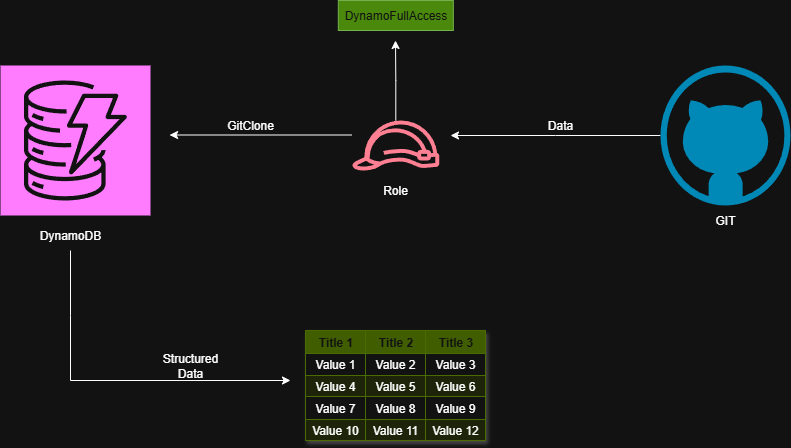
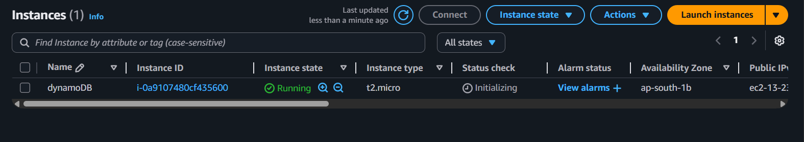
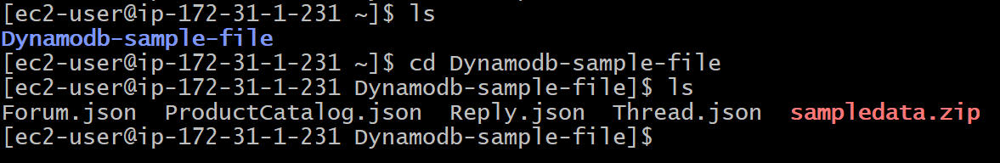
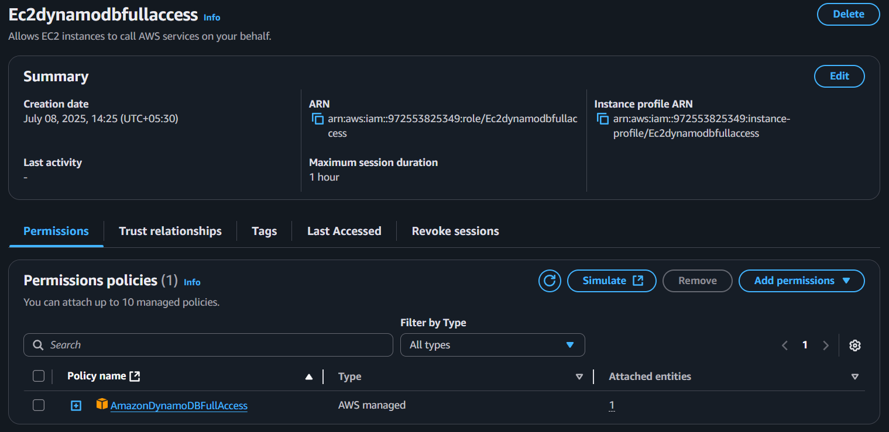

# Git-to-Dynamodb

## Introduction:

Git to Dynamodb is a lightweight data migration tool designed to move structured data (like JSON, CSV, or YAML) directly from a Git repository into an AWS DynamoDB table.

This tool is perfect for scenarios where data such as configuration files, seed data, product catalogs, or environment-specific resources are version-controlled in a Git repo (like GitHub), and need to be migrated or synced into a fast, scalable NoSQL database like DynamoDB.

## Architecture:

## Prerequisites:

- A DynamoDB table created in your preferred region

- An IAM User or Role with the following permissions:
 
   "AWSDynamodbFullAccess"

-  A public or private GitHub (or Git-based) repository containing your data file in one of these formats:

     .json (Array of objects)

    .csv (Tabular data)

    .yaml / .yml (List of dictionaries)

- Use the raw URL to fetch the file contents

## Step-by-step guide:

Step-1:

Create one EC2 instance named "Dynamodb"

ssh server and we have to do certain operations using commands as follows.

- yum update

- yum install git

- git --version

- git clone https://github.com/iamtruptimane/Dynamodb-sample-file

By using these commands git will be installed first and the files will be taken from git to our server.

Step-2:

Now create one table in dyanamodb as same name of files which we have on server.

for ex.ProductCatalog.json

Note:Partition key depends on the unique element in your file(id,data,name,etc)

Step-3:

Now we will need a role to mitigate our data as their is communication  between two services.

A role with EC2 service as a callup service wiht AWSdynamodbfullaccess.

Step-4:

Now attach the role to EC2 instance.

Step-5:

Now we have to mitigate our files/data from server to dynamodb using following command.

aws dynamodb batch-write-item --request-items file://ProductCatalog.json

This will transfer all data of ProductCatalog.json file to dynamodb and will be structured in table format.

We have to do same step from step-5 as it is just change the name of files(forum.json,reply.json,etc).First create table of file name and then use command to mitigate data.

## Summary:

Git to Dynamodb streamlines the process of migrating structured data from Git repositories to AWS DynamoDB. By automating data retrieval, parsing, and insertion, it eliminates manual steps and ensures your application or environment starts with the correct data—version-controlled and cloud-ready.